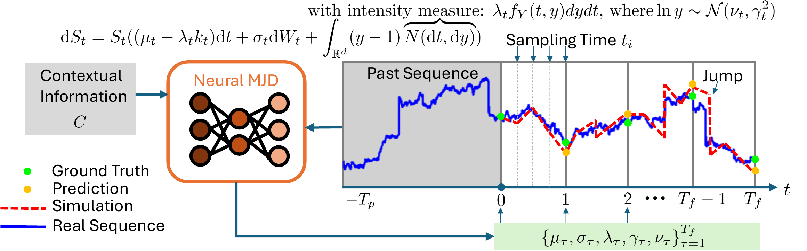

# Neural MJD: Neural Non-Stationary Merton Jump Diffusion for Time Series Prediction

[](https://arxiv.org/abs/2506.04542)

The official PyTorch implementation of "Neural MJD: Neural Non-Stationary Merton Jump Diffusion for Time Series Prediction".

## Overview


We propose Neural MJD, a neural forecasting model that combines time-varying diffusion and jump processes to handle non-stationary time series with abrupt changes.

## Install Python Environment

```bash
conda env create -f setup/conda.yaml
conda activate neuralmjd
```

## Prepare datasets

```bash
### SP500 data
curl -L -o ./data/sandp500.zip https://www.kaggle.com/api/v1/datasets/download/camnugent/sandp500
unzip ./data/sandp500.zip -d ./data/sandp500
```

## Training and Evaluation

### SP500 data

```bash
# Training
python train.py -c config/sp500/mjd/neural_mjd.yaml --dataset_name sp500 -m=$(hostname)

# Testing
python test.py -p=${MODEL_PATH} -m=$(hostname)
```

### Demo use case

Please see [demo_notebook.ipynb](demo_notebook.ipynb) for a demo use case on synthetic data.

## Citation

If you find this work useful, please consider citing:

```bibtex
@article{gao2025neural,
  title={Neural MJD: Neural Non-Stationary Merton Jump Diffusion for Time Series Prediction},
  author={Gao, Yuanpei and Yan, Qi and Leng, Yan and Liao, Renjie},
  journal={arXiv preprint arXiv:2506.04542},
  year={2025}
}
```
